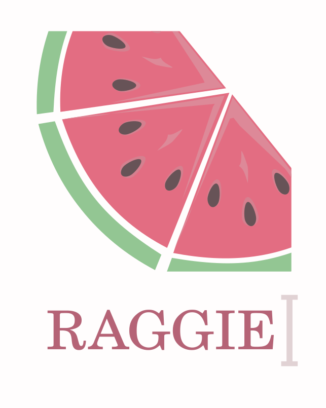

# Raggie Code 

> *Raggie Code v0.1.1 (beta)*

<p style="padding:30px 50px;">
  
</p>

**Raggie** is an autonomous AI coding agent that doesn't just read your codebase. it *understands* it.

Most AI coding assistants dump file contents into a prompt and hope for the best. Raggie is different. It builds a **code semantic index** of your entire codebase, navigates **call graphs**, traces **dependency chains**, and uses that structural understanding to make surgical, context-aware changes. not blind edits.

It plans multi-step tasks with **todo lists**, delegates subtasks to **subagents**, fetches **skills on demand**, and tracks every change in a **built-in git repo** with one-click `/undo` and `/redo`. When the context window fills up, it performs an **automatic handover** to a fresh session. summarizing everything it's done so the next iteration picks up exactly where it left off. All while respecting your `.gitignore`, asking for your approval on big decisions, and working with **any OpenAI-compatible LLM**. local or cloud.

It runs locally. Your code index, chat history, and git repo never leave your machine.

---

## Why Raggie?

### It actually understands your code

Raggie doesn't grep for strings and guess. It parses your codebase with **tree-sitter**. the same parser engine used by Neovim, GitHub code search, and tree-sitter's own language grammars. It tracks all dependencies and all dependents (something tree-sitter alone cannot do), letting the agent analyze the blast radius of each change by knowing what calls what, what imports what, and where every symbol lives. When you ask it to "refactor the auth middleware," it traces the call tree, finds every caller, and updates them all.

**12 languages supported:** Python, JavaScript, TypeScript, Go, Rust, C, C++, C#, PHP, Elixir, Zig, and more.

### It can plan before it acts

Give Raggie a complex task like "migrate the database from SQLite to PostgreSQL" and it won't just start editing files blindly. Itm can create a **todo list**, breaks the work into ordered steps, shows you the plan, and waits for your y/n approval before touching anything. Then it executes each step sequentially via **isolated subagents**. one task at a time, never in parallel, with full context carried forward.

### It never loses context

When the LLM's context window fills up mid-task, Raggie doesn't just truncate and hope. It performs an **automatic session handover**: the agent generates a detailed handover document covering the original goal, current state, decisions made, changes applied, test results, errors encountered, and the exact next step. then spins up a fresh session that picks up the work seamlessly. You can also resume interrupted todo lists and converations across sessions.

### It's safe by design

- **Built-in git repo**: Every change is committed to `.raggie/git/`. Type `/undo` to undo instantly, `/redo` to re-apply.
- **`.gitignore` / `.aiignore` respected**: The agent can't read, write, or modify ignored files. If a `.aiignore` file exists, it's used instead of `.gitignore` for both file access and code indexing.
- **Human-in-the-loop**: The `AskUser` tool lets the agent ask you questions mid-task. Todo list plans require your approval before execution.
- **Crash recovery**: Undo/redo operations use marker files for crash safety. Interrupted todo lists are detected and offered for resumption on next startup.

### It gets smarter over time

Raggie's **skills system** lets it learn and persist knowledge across sessions. Skills are named instruction sets (like `code/testing` or `code/git-workflow`) stored in the database. At startup, only brief summaries go into the system prompt. the full content is fetched on demand via `GetSkill`, saving tokens. The agent can even create its own skills with `SetSkill` (with your consent). Skills survive across sessions, can be imported/exported as Markdown files, and stack with project-specific `AGENTS.md` overrides.

### It works with your stack

- **Any OpenAI-compatible LLM**: OpenAI, DeepSeek, OpenRouter, Ollama, vLLM, LocalAI. if it speaks the OpenAI API, Raggie works with it.
- **31 tools**: Code exploration, file operations, shell execution (including background processes), web search, web fetch, and more.
- **Project-specific customization**: Drop an `AGENTS.md` in your project root and the agent picks up your conventions automatically.
- **Role-based configuration**: Define multiple agent roles with different models, tools, and system prompts.

### It's transparent

Every tool call is displayed in real time with its arguments. Debug mode (`--debug`) shows full tool outputs. The `ViewChanges` tool lets the agent introspect its own git history. status, diffs, and commit log. You always know what the agent is doing, what it changed, and why.

---

## Feature Overview

| Feature | What it means |
|---|---|
| **code semantic indexing** | Full codebase parsing into symbols, functions, classes, imports, and dependency graphs (blast radius analysis). not just text search |
| **Call graph traversal** | BFS traversal from any entry point with cycle detection (depth 5). Trace execution flow across your entire codebase |
| **Fuzzy symbol search** | Find functions/classes/variables by name even when you don't know the exact spelling |
| **Multi-step task planning** | Todo list system with user approval gates, sequential subagent execution, and crash recovery |
| **Subagent delegation** | Spawn child agents for subtasks (up to 3 levels deep) with optional timeouts |
| **Automatic context handover** | When the context window fills up, the agent generates a handover document and continues in a fresh session |
| **Skills system** | Persistent, on-demand instruction sets that the agent advertises and fetches as needed |
| **Built-in git versioning** | Every change committed automatically. `/undo` to undo, `/redo` to redo. Full diff and log introspection |
| **Human-in-the-loop** | `AskUser` tool for mid-task questions. Todo list approval gates. `SetSkill` requires user consent |
| **31 tools** | Code exploration, file I/O, shell (foreground + background), web search/fetch, and more |
| **`.gitignore` / `.aiignore` enforcement** | Ignored files are invisible to the agent. can't read, write, modify, or index them. Use `.aiignore` to control this independently of git |
| **12+ languages** | Python, JavaScript, TypeScript, Go, Rust, C, C++, C#, PHP, Elixir, Zig, and more |
| **Any OpenAI-compatible LLM** | Works with OpenAI, DeepSeek, OpenRouter, Ollama, vLLM, LocalAI, and anything else that speaks the OpenAI API |
| **Persistent chat history** | SQLite-backed sessions, messages, skills, and todo lists. all survive across restarts |
| **Project customization** | `AGENTS.md` for project conventions, `roles.json` for model/tool configuration, skills for persistent instructions |
| **Background shell execution** | Run long-running commands (dev servers, watchers) non-blocking with PID tracking and kill support |
| **Web search & fetch** | Search the web via DuckDuckGo and fetch URL content. the agent can look up docs and APIs |
| **Multiprocessing indexing** | Tree-sitter parsing uses multiprocessing for fast indexing of large codebases |

---

## Table of Contents

- [Installation](#installation)
- [Quick Start](#quick-start)
- [Commands Reference](#commands-reference)
- [In-Chat Commands](#in-chat-commands)
- [Architecture](#architecture)
- [Configuration](#configuration)
- [Tools Reference](#tools-reference)
- [Skills System](#skills-system)
- [Todo List System](#todo-list-system)
- [Code Indexing](#code-indexing)
- [Git Integration](#git-integration)
- [FAQ](#faq)

---

## Installation

### From pip (GitHub)

```bash
pip install git+https://github.com/hussein-l-almadhachi/raggie.git
```

### From source

```bash
git clone https://github.com/hussein-l-almadhachi/raggie.git
cd raggie
pip install .
```

### Requirements

- Python 3.10+
- An API key for an OpenAI-compatible LLM provider (OpenAI, DeepSeek, OpenRouter, etc.)

### First-time setup

```bash
raggie setup
```

This guided wizard walks you through:
1. Adding your API keys
2. Reviewing agent roles (model, base URL)

---

## Quick Start

### 1. Run the setup wizard

```bash
raggie setup
```

You'll be prompted to add API keys and review your agent roles in one seamless flow.

### 2. Run the agent

```bash
# Single prompt mode (in current directory)
raggie code . --prompt "Write a hello world function in Python"

# Single prompt mode (in a specific project)
raggie code /path/to/project --prompt "Write a hello world function in Python"

# Interactive mode (chat loop)
raggie code /path/to/project

# Interactive mode in current directory
raggie code .
```

In interactive mode:
- **Enter** to send your message
- **Esc then Enter** for multi-line input
- **`exit`** or **`quit`** to leave
- **`!command`** to run a shell command directly (e.g. `!ls -la`)

### 3. Undo if something goes wrong

After the agent makes changes, type `/undo` as your next prompt to undo the last commit. Type `/redo` to re-apply it.

### See it in action

```bash
$ raggie code .

Raggie Agent (code) v1.0.0 - Interactive Mode
Press Esc followed by Enter to send message, or type 'exit' to quit
--------------------------------------------------
Indexing codebase...

You:
> Add input validation to the login endpoint and update all callers

Agent:
I'll start by finding the login endpoint and tracing its callers.

  [tool] GetSymbolSourceCode(name="login")
  [tool] WalkCallTree(entry_point="login", depth=3)
  [tool] GetFileCodeSemantics(file_path="src/auth/views.py")

I found the login endpoint at `src/auth/views.py:42` and 3 callers across
the codebase. I'll add validation for the email and password fields,
then update each caller to handle the new validation errors.

  [tool] ReplaceText(file_path="src/auth/views.py", ...)
  [tool] ReplaceText(file_path="src/api/routes.py", ...)
  [tool] ReplaceText(file_path="tests/test_auth.py", ...)
  [tool] Shell(command="python -m pytest tests/test_auth.py")

All 3 callers updated and tests pass. Changes committed.
type /undo to undo the last code changes
```

---

## Commands Reference

### `raggie <role> <project-dir>`

Run the AI agent with a specific role in a project directory.

| Argument | Description |
|---|---|
| `role` | (Required) Agent role, defined in `roles.json`. Default: `"code"` |
| `project-dir` | (Optional) Path to the project directory. Use `.` for current directory. Created if it doesn't exist. Default: `.` |
| `--prompt` | (Optional) Single prompt. Omit for interactive mode |
| `--debug` | Show raw tool call outputs for debugging |

**Examples:**
```bash
raggie code /path/to/project --prompt "Refactor the API router to use dependency injection"
raggie code /path/to/project
raggie code . --debug
```

### `raggie setup`

First-time setup wizard. Guides you through configuring API keys and reviewing agent roles. everything needed to get started.

### `raggie keys`

Manage API keys via an interactive menu. Keys are stored in `~/.config/raggie/keys.json`.

Options: Add key, Remove key, Exit.

### `raggie roles`

List and edit agent roles via an interactive menu. Roles are stored in `~/.config/raggie/roles.json`.

Options: Edit role's base URL / model, Exit.

### `raggie skill [role]`

Manage named skills stored in the database. A role can have multiple skills, each identified by a unique name.

Running `raggie skill` or `raggie skill <role>` without flags opens an interactive menu (like `raggie keys` and `raggie roles`):

```
Skills for role 'code'
------------------------------------------------------------
  1. testing: Always write tests after implementing. Use pytest.
  2. refactoring: When refactoring, preserve behavior.
------------------------------------------------------------
0. Exit
1. View skill content
2. Delete skill
3. Export skill to file
4. Import skill from file
5. List all skills (all roles)
```

For scripting, flags are also available:

| Flag | Description |
|---|---|
| `--show` | Display all skills for the role (or a specific skill with `--name`) |
| `--name <name>` | Specify the skill name (required for import/export/delete) |
| `--import-skill <file>` | Import a skill from a Markdown file into the database (requires `--name`) |
| `--export-skill <file>` | Export a skill from the database to a Markdown file (requires `--name`) |
| `--delete` | Delete a skill (requires `--name`) |
| `--list-all` | List all skills across all roles (role arg not required) |

**Examples:**
```bash
raggie skill code                          # interactive menu for role 'code'
raggie skill                               # interactive menu (all roles)
raggie skill code --show --name testing     # show full content of a specific skill
raggie skill code --import-skill my-skills.md --name testing   # import from file
raggie skill code --export-skill backup.md --name testing      # export to file
raggie skill code --delete --name testing   # delete a skill
raggie skill --list-all                    # list all skills across all roles
```

---

## In-Chat Commands

These commands are available inside the interactive chat loop. They are intercepted before reaching the LLM and handled locally.

| Command | Description |
|---|---|
| `/undo` | Undo the last agent commit (restore previous file state) |
| `/redo` | Re-apply the last undone commit |
| `/streaming on\|off` | Toggle streaming mode mid-conversation. Persists to `roles.json` |
| `/reasoning on\|off` | Toggle reasoning output mid-conversation. Persists to `roles.json` |
| `/windowSize <number>` | Set the context window size (in tokens) for handover logic. Persists to `roles.json` |
| `/help` | Show available in-chat commands |
| `!<command>` | Run a shell command directly (e.g. `!ls -la`, `!pytest tests/`) |

**Notes:**
- `/streaming`, `/reasoning`, and `/windowSize` take effect on the next message and persist to `~/.config/raggie/roles.json` so they survive across sessions.
- Calling `/streaming` or `/reasoning` without arguments shows the current status.
- Calling `/windowSize` without arguments shows the current context window size.
- Shell commands run via `!` are executed in the project directory and their output is printed directly. They do not go through the LLM.

---

## Architecture

```
raggie/
├── raggie.py                  # Entry point. parses args (role + project-dir), runs agent loop
├── src/
│   ├── cli.py                 # Argument parser (argparse)
│   ├── chat.py                # Watermelon-themed status messages (flavor)
│   ├── config/                # Default configuration files
│   │   ├── roles.json         # Agent role definitions
│   │   ├── tools.json         # Tool definitions for LLM function calling
│   │   └── coder_system_prompt.md  # System prompt for the code role
│   ├── Agent/
│   │   ├── agent.py           # Core Agent class. prompt loop, tool execution, commit
│   │   ├── config.py          # Config loader. reads from ~/.config/raggie/
│   │   ├── tools.py           # ToolRegistry. maps tool names to handler functions
│   │   ├── chat_history_db.py # SQLite DB. sessions, messages, skills, todo lists
│   │   └── git_manager.py     # Local git repo in .raggie/git/ for versioning
│   ├── Tools/
│   │   ├── __init__.py        # Registers all tool handlers with the registry
│   │   ├── read.py            # UglyWholeFileContentDump
│   │   ├── write.py           # WriteFile
│   │   ├── replace.py         # ReplaceText
│   │   ├── remove.py          # RemoveFile
│   │   ├── shell.py           # Shell command execution
│   │   ├── shell_background.py # ShellBackground. non-blocking shell commands
│   │   ├── shell_kill.py      # ShellKill. kill background processes
│   │   ├── search.py          # SearchAllFilesContent (grep)
│   │   ├── list_dir.py        # ListDir
│   │   ├── web_fetch.py       # WebFetch
│   │   ├── web_search.py      # WebSearch
│   │   ├── view_changes.py    # ViewChanges (git status/diff/log)
│   │   ├── dispatch_subagent.py  # DispatchSubagent. spawns child agents
│   │   ├── todo_list.py       # Todo list CRUD + execution
│   │   ├── GetSymbolSourceCode.py  # GetSymbolSourceCode
│   │   ├── GetFileCodeStructure.py  # GetFileCodeSemantics
│   │   ├── walk_call_tree.py  # WalkCallTree
│   │   ├── fuzzy_search.py    # FileNameSearch (fuzzy file name matching)
│   │   └── utils.py           # Colors, is_within_cwd, is_ignored_by_gitignore
│   ├── indexing/
│   │   ├── code_indexer.py    # Tree-sitter based code indexer
│   │   ├── code_index_sdk.py  # SDK for querying the code index
│   │   ├── file_utils.py      # File walking utilities
│   │   ├── extracts.py        # Symbol extraction per language
│   │   ├── language_config.py # Language parser configurations
│   │   ├── models.py          # Data models (Symbol, Function, Class, etc.)
│   │   ├── db_schema.py       # SQLite schema for the code index
│   │   ├── node_utils.py      # Tree-sitter node helpers
│   │   ├── queries.py         # Tree-sitter query patterns
│   │   ├── parse_worker.py    # Multiprocessing parse worker
│   │   └── export_to_json.py  # Export index to JSON
│   ├── RAG/
│   │   ├── find.py            # Find symbols in the index
│   │   └── graph.py           # Dependency graph traversal
│   └── skills/
│       ├── __init__.py        # Exports SkillManager
│       ├── manager.py         # SkillManager. CRUD for named skills (role + name)
│       └── tool.py            # SetSkill + GetSkill tool handlers
├── AGENTS.md                  # Project-specific overrides (auto-loaded)
├── pyproject.toml             # Package metadata + dependencies
├── .raggie/
│   ├── .raggie.chat           # SQLite DB: sessions, messages, skills, todo lists
│   ├── .code_index.raggie     # SQLite DB: tree-sitter code index
│   └── git/                   # Local git repo for change tracking
└── requirements.txt           # pip dependencies
```

### How the Agent Works

1. **Startup**: The agent loads its role config, connects to the LLM API, indexes your codebase (tree-sitter, multiprocessing), and initialises its local git repo.
2. **Prompt loop**: User sends a message → agent calls the LLM with full chat history + tool definitions → LLM responds with text and/or tool calls.
3. **Tool execution**: Each tool call is dispatched to a registered handler. Results are fed back to the LLM as tool responses.
4. **Re-indexing**: After each tool call, the code index is updated so the agent always has fresh context.
5. **Context handover**: When the context window is nearly full, the agent generates a detailed handover document and seamlessly continues in a new session. no lost progress.
6. **Commit**: When the agent finishes responding (no more tool calls), all files changed during the session are committed to `.raggie/git/`.
7. **Undo/Redo**: Type `/undo` to undo the last commit and restore the previous state. Type `/redo` to re-apply an undone commit.

---

## Configuration

### User Config Directory

All user-specific config lives in `~/.config/raggie/`:

```
~/.config/raggie/
├── keys.json     # API keys (base_url -> key mappings)
├── roles.json    # Role definitions (copied from src/config/ on first run)
└── tools.json    # Tool definitions (copied from src/config/ on first run)
```

### `roles.json`

Defines agent roles. Each role has a model, base URL, tools list, and system prompt.

```json
{
  "code": {
    "tools": ["UglyWholeFileContentDump", "Shell", "WriteFile", ...],
    "model": "deepseek-v4-flash",
    "base_url": "https://api.deepseek.com",
    "system_prompt_file": "coder_system_prompt.md"
  }
}
```

### `AGENTS.md`

Place a file called `AGENTS.md` in the project root. Its contents are automatically appended to the agent's system prompt every time it starts. Useful for project-specific conventions:

```markdown
# Project Conventions
- Use TypeScript for all new files
- Tests go in a __tests__/ directory
- Follow the existing ESLint config
```

### `.gitignore` and `.aiignore`

Raggie uses ignore patterns to determine which files are off-limits. If a `.aiignore` file exists in the project root, it is used **instead of** `.gitignore` for both code indexing and agent file access enforcement. If no `.aiignore` exists, `.gitignore` is used as a fallback.

When `.aiignore` is active, files matched by its patterns cannot be read, written, modified, or indexed by the agent. This gives you a single file to control what the agent sees and touches, independently of your git configuration.

`.aiignore` uses the same pattern syntax as `.gitignore`.

---

## Tools Reference

Raggie provides 31 tools to the LLM. Here they are grouped by category:

### Code Exploration

this part is powered by the code indexer (code analysis and dependency tracking engine )

| Tool | What it does |
|---|---|
| `GetFileCodeSemantics` | Show a file's structure: functions, classes, imports, dependencies, with optional full source bodies |
| `GetSymbolSourceCode` | Get full source of a function/class/variable by name with fuzzy search fallback |
| `WalkCallTree` | BFS traversal of the call graph from any entry point (up to depth 5, cycle detection) |
| `UglyWholeFileContentDump` | Read raw file contents (throttled. prefer semantic tools first) |
| `ListDir` | List directory contents with type and size |
| `SearchAllFilesContent` | Regex grep across files/directories |
| `FileNameSearch` | Fuzzy search for file names by partial or approximate match (top 5 results) |

### File Operations

| Tool | What it does |
|---|---|
| `WriteFile` | Create or overwrite a file (auto-creates dirs, respects .gitignore) |
| `ReplaceText` | Find-and-replace in an existing file (literal or regex, supports replace_all) |
| `RemoveFile` | Delete a file or directory (refuses gitignored paths) |
| `Shell` | Execute a shell command (for build, test, etc.) |
| `ShellBackground` | Start a shell command in the background (non-blocking, returns PID) |
| `ShellKill` | Kill a background shell process by PID |

### Information Gathering

| Tool | What it does |
|---|---|
| `WebFetch` | Fetch a URL and return readable text (HTML stripped, configurable max chars) |
| `WebSearch` | Search the web via DuckDuckGo (up to 20 results, optional region) |

### Agent Management & Communication

| Tool | What it does |
|---|---|
| `DispatchSubagent` | Spawn a child agent to handle a subtask (max 3 levels deep, optional timeout) |
| `SetSkill` | Create/update a named skill for the agent's own role (requires user consent) |
| `GetSkill` | Fetch the full content of a skill by role and name |
| `ViewChanges` | Show git status, diff, or log from `.raggie/git/` |
| `AskUser` | Ask the user a question mid-task, optionally with predefined options (single or multiple choice, or free-form) |

### Todo Lists

| Tool | What it does |
|---|---|
| `CreateTodoList` | Create a new todo list |
| `AddTask` | Add a task with goal, requirements, notes, and order |
| `GetTodoList` | View the plan with all tasks and their status |
| `ApproveTodoList` | Present the plan to the user for y/n approval |
| `ExecuteNextTask` | Dispatch a subagent to execute the next pending task |
| `MarkTaskComplete` | Manually mark a task as done (auto-deletes todo list if all done) |
| `MarkTaskFailed` | Mark a task as failed |
| `MarkTaskCancelled` | Mark a task as cancelled (skipped intentionally) |
| `GetActiveTodoList` | Check for an incomplete todo list to resume |

---

## Skills System

Skills are named instruction sets stored in the database and advertised to the agent at startup. A role can have multiple skills, each identified by a unique name.

### How it works

1. **At startup**, all skills are listed as brief summaries in the system prompt (e.g. `code/testing: Always write tests after implementing...`)
2. **The LLM picks** the skill it needs and calls `GetSkill(role, name)` to fetch the full content
3. **The full skill content** is returned as a tool response, giving the agent detailed instructions for the task at hand

### Key characteristics

- **Persistent**: Skills survive across sessions
- **Multiple per role**: Each role can have many named skills (e.g. `code/testing`, `code/refactoring`, `code/git-workflow`)
- **On-demand loading**: Only summaries go into the system prompt. full content is fetched when needed, saving tokens
- **User-controlled**: The `SetSkill` tool always asks for user consent before applying changes
- **Override with AGENTS.md**: Project-specific instructions in `AGENTS.md` are appended after skills

### Managing skills

```bash
# List all skills for a role
raggie skill code

# Show a specific skill
raggie skill code --show --name testing

# Import from a file
raggie skill code --import-skill my-skills.md --name testing

# Export to a file (backup)
raggie skill code --export-skill backup.md --name testing

# Delete a skill
raggie skill code --delete --name testing

# List all skills across all roles
raggie skill --list-all
```

### How skills stack

At startup, the agent builds its system prompt in this order:

1. Role system prompt file (e.g. `coder_system_prompt.md`)
2. Current date, working directory, host system info
3. All skill summaries from database (role/name: one-line summary)
4. `AGENTS.md` from project root (if it exists)

---

## Todo List System

The todo list system lets the agent plan and execute complex multi-step tasks with user oversight.

### Workflow

```
1. GetActiveTodoList  →  check for existing incomplete todo list
2. CreateTodoList     →  create a new list
3. AddTask (x N)     →  add tasks with goals and requirements
4. GetTodoList        →  review the plan
5. ApproveTodoList    →  present to user for y/n approval
6. ExecuteNextTask    →  execute tasks one by one via subagents
```

### Key behaviors

- **Sequential execution**: Tasks run one at a time, never in parallel
- **Subagent isolation**: Each task is handled by a fresh subagent that receives context from completed tasks
- **Auto-deletion**: When all tasks are done, the todo list is automatically removed from the database
- **Crash recovery**: If the session is interrupted, `GetActiveTodoList` returns the incomplete list and the user is offered to resume it
- **Nested todo lists**: Subagents can create their own todo lists for complex subtasks (up to 3 levels deep)

---

## Code Indexing

At startup and after every tool call, Raggie indexes your codebase using tree-sitter. This gives the agent:

- **Symbol definitions**: Functions, classes, methods, and their locations
- **Dependency graphs**: What calls what, what imports what
- **Call trees**: Full execution flow from any entry point
- **Fuzzy search**: Find symbols even if you don't know the exact name

### Supported languages

Python, JavaScript, TypeScript, Go, Rust, C, C++, C#, PHP, Elixir, Zig, and more.

### Data location

The index is stored in `.raggie/.code_index.raggie` (SQLite).

### `.aiignore`

The code indexer and agent file tools respect a `.aiignore` file in the project root. If present, it is used **instead of** `.gitignore` to determine which files are off-limits — for both indexing and file read/write/modify enforcement. If no `.aiignore` exists, `.gitignore` is used as a fallback.

This lets you control what the agent sees and touches independently of your git configuration. `.aiignore` uses the same pattern syntax as `.gitignore`.

---

## Git Integration

Raggie maintains a local git repository at `.raggie/git/` for change tracking and rollback.

### How it works

1. **After every response**: The agent commits all current project files to `.raggie/git/`
2. **Commit messages**: Include the user prompt, tool call count, and agent response summary
3. **Proper nested trees**: Subdirectories are stored as proper git tree objects (standard git compatible)
4. **Undo/Redo**: Type `/undo` to undo the last commit and restore files. Type `/redo` to re-apply an undone commit.

### Commands

```
/undo            →  Undo the last commit (restore previous state)
/redo            →  Redo the last undone commit (re-apply)
```

### The `ViewChanges` tool

The agent can introspect the git repo itself:

| view_type | What it shows |
|---|---|
| `status` | Files added/modified/deleted/unchanged since last commit |
| `diff` | Actual line-by-line diffs (with optional path filter and line limit) |
| `log` | Commit history (with configurable max count) |

### Ignore file support

- Files matched by `.aiignore` (or `.gitignore` as fallback) are excluded from commits and status checks
- Common exclusions are hardcoded as fallback: `.raggie`, `.git`, `.venv`, `__pycache__`, `build`, `dist`, `.egg-info`, and binary extensions

### Crash safety

The undo and redo operations write marker files (`.raggie/.undoing` and `.raggie/.redoing`) before deleting files, and remove them after successful restoration. If the process crashes mid-operation, the marker is detected on next startup and a warning is displayed. The redo stack (`.raggie/.redo_stack`) tracks undone commits so they can be re-applied; it is cleared when a new commit is made.

---

## FAQ

### Does my code get sent to an external API?

Yes. your prompts and the agent's responses are sent to the LLM provider you configure (OpenAI, OpenRouter, DeepSeek, etc.). The code index and git repo stay local.

### Can I use it with a local model?

Yes. Point `base_url` to any OpenAI-compatible local server (e.g. Ollama, vLLM, LocalAI) in your `~/.config/raggie/roles.json`.

### Where is my data stored?

```
.raggie/
├── .raggie.chat           # Chat sessions and messages
├── .code_index.raggie     # Tree-sitter code index
└── git/                   # Local git repository for changes
```

All of this is in your project directory and is gitignored by default.

### How do I stop the agent from making changes?

The agent only writes files when you explicitly ask it to. You can review changes before accepting them. The `/undo` command undoes the last set of changes, and `/redo` re-applies them.

### Can I customise the agent's behavior?

Yes. Create a `AGENTS.md` file in your project root with custom instructions. Edit `roles.json` to change models or tools per role. Use `raggie skill code --import-skill ... --name <name>` to add persistent named skills.

### What happens if I interrupt the agent mid-task?

Todo lists are persisted in the database. When you restart, the agent checks for incomplete todo lists and offers to resume them. The git repo also has the last committed state for recovery.

### What happens when the context window fills up?

Raggie performs an **automatic session handover**. The agent generates a detailed handover document (original goal, current state, decisions made, changes applied, test results, errors, next step) and continues in a fresh session. so it can work on large tasks that exceed a single context window without losing progress.

### Can the agent ask me questions?

Yes. The `AskUser` tool lets the agent ask you questions mid-task, optionally with predefined options (single-choice, multiple-choice, or free-form). This means the agent can clarify requirements, confirm design decisions, or ask for preferences without guessing.

### License
```
Copyright 2026 Hussein Layth Al-Madhachi

Licensed under the Apache License, Version 2.0 (the "License");
you may not use this file except in compliance with the License.
You may obtain a copy of the License at

    http://www.apache.org/licenses/LICENSE-2.0

Unless required by applicable law or agreed to in writing, software
distributed under the License is distributed on an "AS IS" BASIS,
WITHOUT WARRANTIES OR CONDITIONS OF ANY KIND, either express or implied.
See the License for the specific language governing permissions and
limitations under the License.
```